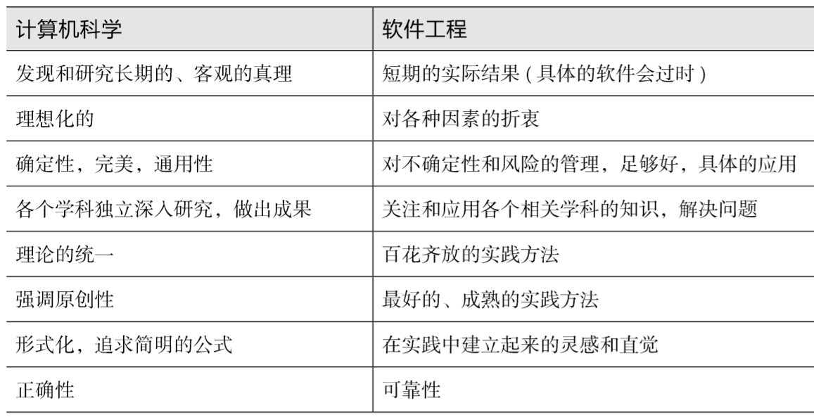

Title: AI简述
Date: 2019-7-16 17:00
Category: AI
Tags: Tech,AI 
Authors: leelongcrazy
Summary: 阅读AI笔记部分内容摘录

AI简述
===
## 
### 广义的人工智能是指“通过计算机实现人类思维的效果，能从环境中获取感知并行动“ 的现象。
### 我们大致可以把广义人工智能分为弱人工智能和强人工智能。
**弱人工智能**
### 处理特定的问题，并不具有人类感知能力。弱人工智能包含了机器学习，机器学习又包括了深度学习。

**强人工智能**
### 是具备与人类同等智慧或超越人类的人工智能，能表现正常人类所具有的所有智能行为。
## 
## 计算机科学与软件工程的明显区别
### 下图展示了两者的区别：

## 
## 学习AI建议
- *有科学家素养的工程师*
- **在AI领域具备*源头创新能力*，具备解决企业关键技术难题的能力**
    + 源头创新能力:如果要培养源头创新能力，那么就需要打开一些黑盒子，刨根问底，而不能满足于仅仅会调用一些函数，使用一些现成的工具。
## 
## 核心能力是什么
### 我们要培养的能力是计算思维，是：
- 观察，找到事物变化的模式和规律；
- 逻辑的组织和分析数据；
- 把问题解法变为有组织，可重复的步骤；
- 把问题解法抽象，变为更通用，应用在更多领域。

### 强调*动手+动脑*，不要急于学习最时髦的东西，而是要把基础数学和基础编程学习好，锻炼高质量的工程能力，自己提出问题，自己解决问题。
## 
文章摘抄来源：[https://github.com/microsoft/ai-edu/blob/master/B-教学案例与实践/B0-introduction/AI301_intro.md](https://github.com/microsoft/ai-edu/blob/master/B-%E6%95%99%E5%AD%A6%E6%A1%88%E4%BE%8B%E4%B8%8E%E5%AE%9E%E8%B7%B5/B0-introduction/AI301_intro.md)