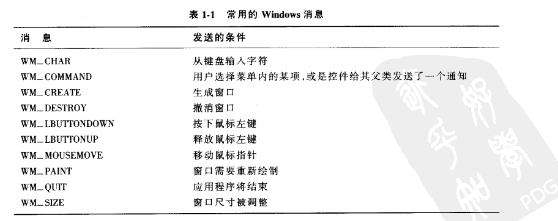

Title: MFC框架笔记
Date: 2021-3-2 17:00
Category: CPP
Tags: MFC,Programe
Authors: leelongcrazy
Summary: MFC框架学习笔记

# 学习MFC前技术基础

## WIN32程序概念：

* message based: 文档基础
* event driven: 事件驱动
* multitasking: 多任务
* multithreading:多线程
* console programing:

## C++基础：

* 类和对象
* this指针和继承
* 静态成员
* 虚函数与多态
* 模板（template）类
* 异常处理（exception handling）

## MFC重点：

* CWinApp类：
* CFrameWnd类：
* CPaintDC类
* 消息映射机制

## 框架 MFC简介

* 微软基础类库（Microsoft Foundation Class），是微软公司提供的一个类库，以c++类的形式封装了win32 API，并且包含了一个应用程序框架。所以，MFC其实一个库和框架的混合体。
* 库包含了类、对象和方法等已供程序员直接使用，而Framework则包含了更多的东西，如多种不同的库，资源等。并且库和框架之间还有一个调用上的不同 [详细](https://martinfowler.com/bliki/InversionOfControl.html)
* 桌面程序需要实现的两大功能
  * 窗口创建
  * 消息处理
* MFC完成功能实现的基本流程
  * 设计窗口类
  * 注册窗口类
  * 创建窗口
  * 显示和更新窗口
  * 消息获取
  * 消息处理


# MFC


## 基础：

* UINT类型是由unsigned int类型派生出来的

## 字符串与数值类型之间的转换

``` C++
    //字符串变为数字.通用版.
    nNum1 = _ttoi(ch1);  

    //数字转为字符串.设置到编辑框三种.
    _itot(nNum3, ch3, 10); //十进制转换.
```


## afx_msg

是应用框架产生的消息映射函数。

afx_msg为消息标志，向系统声明：有消息映射到函数实现体；而在map宏定义中，就有具体消息和此函数的映射定义。

在类头中增加消息声明；在类实现文件中增加消息定义和执行函数。



## 文档/视图体系结构

依靠文档保存应用程序的数据，依靠视图对象控制视图中显示的数据。


## 视图：

* 用户视角，视图就是一个普通的窗口
* 程序员的视角，视图是一个个C++ 对象，派生自MFC中CView类
* 

## 消息映射


## 资源编辑器（.rc）


## MFC基础：

### 画图：CPaintDC类响应WM_PAINT消息，允许你在窗口客户区画图。

### 鼠标和键盘：

#### 客户区鼠标消息


``` C++
afx_msg void OnMsgName (UINT nFlags, CPoint point)
    // point 指出光标的位置； nFlags指出消息产生时鼠标键以及shift键和Ctrl键的状态
```


##### 从键盘获取输入

* 输入焦点的概念：
* 获取击键码：

#### 菜单

* 创建菜单：在资源描述文件（.rc）中添加

* 加载并显示菜单：

  * ``` c++
    CMainWindow::CMainWindow()
    {
    	Create(NULL, _T("The Hello Application"), WS_OVERLAPPEDWINDOW | WS_VSCROLL | WS_HSCROLL | WS_SYSMENU | WS_CAPTION,
    		CRect(400, 100, 1200, 1000), NULL, MAKEINTRESOURCE(IDR_MAINFRAME));
    }
    ```

  * MAKEINTRESOURCE(IDR_MAINFRAME)

## MFC集合类

* 数组
* 列表
* 映射表：设计映射表的目的是给定一个关键字，可以很快在表中找到响应的项目，通常只查找一次。
* 类型指针类


## 文件的I/O及序列化


## 控件

* 传统控件：6个预定义的WNDCLASS
* 
* 


## 对话框

创建对话框的步骤：

1. 创建对话框资源：创建新的对话框模板、设置对话框属性和为对话框添加各种控件
2. 生成对话框类：新建对话框类、添加控件变量和控件的消息处理函数等

在资源视图页面：Ctrl+D可以更改tab顺序数字，按ESC键退出

对话框分为两类：

1. 模态对话框：当它弹出后，本应用程序其他窗口将不再接受用户输入，只有该对话框响应用户输入，在对它进行相应操作退出后，其他窗口才能继续与用户交互
2. 非模态对话框：它弹出后，本程序其他窗口仍能响应用户输入。非模态对话框一般用来显示提示信息等。

#### 关闭对话框的方式：

``` C ++
// 退出程序
	AfxGetMainWnd->SendMessage(WM_CLOSE);
// 关闭当前窗口
	DestoryWindow();
// 关闭模式对话框
	EndDialog(0);
```


对话框：消息对话框

1. CWnd::MessageBox()

2. CWnd::AfxMessageBox()

3. 用例：

4. ``` C++
   res = MessageBox(_T("您确定要进行乘法计算吗？"), _T("乘法计算器"), MB_OKCANCEL | MB_ICONQUESTION);
   	res = AfxMessageBox(_T("您确定要进行乘法计算吗？"), MB_OKCANCEL | MB_ICONASTERISK);
   ```

5. 

## 编辑控制（CEdit)

两种类别：Control 和 Value

变量类型为：

* CEdit  
* CString

``` C++
// CEdit
	c_edit.GetWindowText() // 获取变量值 CString类型
    c_edit.SetWindowText() // 设置变量值
// Cstring
    // 直接对变量赋 CString类型
        c_edit = str
        SetDlgItemText(IDC_EDIT1, str);
// Int
		SetDlgItemInt(IDC_EDIT1, int);
```

## 组合框控件

CComboBox类

主要成员函数：

int GetCount( ) const;
       获取组合框控件的列表框中列表项的数量。

int GetCurSel( ) const;
   获取组合框控件的列表框中选中项的索引，如果没有选中任何项，该函数返回CB_ERR。

int SetCurSel(int nSelect);
   在组合框控件的列表框中选择某项。nSelect参数指定了要选择的列表项的索引，如果为-1则列表框中当前选择项被取消选中，编辑框也被清空。

void GetLBText(int nIndex,CString& rString) const;
       从组合框控件的列表框中获取某项的字符串。nIndex参数指定要获取字符串的列表项的索引，CString参数用于接收取到的字符串。

int GetLBTextLen(int nIndex) const;
       获取组合框控件的列表框中某项的字符串长度。nIndex参数指定要获取字符串长度的列表项的索引。  

int AddString(LPCTSTR lpszString);
   为组合框控件中的列表框添加新的列表项。lpszString参数是指向要添加的字符串的指针。该函数的返回值如果大于等于0，那么它就是新列表项的索引，而如果有错误发生则会返回CB_ERR，如果没有足够的内存存放新字符串则返回CB_ERRSPACE。

int DeleteString(UINT nIndex);
   删除组合框中某指定位置的列表项。nIndex参数指定了要删除的列表项的索引。该函数的返回值如果大于等于0，那么它就是组合框中剩余列表项的数量。如果nIndex指定的索引超出了列表项的数量则返回CB_ERR。

int FindString(int nStartAfter,LPCTSTR lpszString) const;
   在组合框控件的列表框中查找但不选中第一个包含指定前缀的列表项。nStartAfter参数指定了第一个要查找的列表项之前的那个列表项的索引。lpszString指向包含要查找的前缀的字符串。该函数的返回值如果大于等于0，那么它是匹配列表项的索引，如果查找失败则返回CB_ERR。

int InsertString(int nIndex,LPCTSTR lpszString);
   向组合框控件的列表框中插入一个列表项。nIndex参数指定了要插入列表项的位置，lpszString参数则指定了要插入的字符串。该函数返回字符串被插入的位置，如果有错误发生则会返回CB_ERR，如果没有足够的内存存放新字符串则返回CB_ERRSPACE。

int SelectString(int nStartAfter,LPCTSTR lpszString);
   在组合框控件的列表框中查找一个字符串，如果查找到则选中它，并将其显示到编辑框中。参数同FindString。如果字符串被查找到则返回此列表项的索引，如果查找失败则返回CB_ERR，并且当前选择项不改变。

使用步骤：

1. 在DlgClass::OnInitDialog()中初始化ComboBox内容；可指定默认第一选项；
2. 定义CBN_SELCHANGE消息的处理函数；获取组合框的选中索引，根据索引获取组合框中的对应值


## 滚动条控件

CSrollBar类

```C++
// 滚动条条拖动状态
SB_LINEUP           0
SB_LINELEFT         0
SB_LINEDOWN         1
SB_LINERIGHT        1
SB_PAGEUP           2
SB_PAGELEFT         2
SB_PAGEDOWN         3
SB_PAGERIGHT        3
SB_THUMBPOSITION    4
SB_THUMBTRACK       5
SB_TOP              6
SB_LEFT             6
SB_BOTTOM           7
SB_RIGHT            7
SB_ENDSCROLL        8
```


## 列表视图控件

CListCtrl类内部的成员函数：

  **UINT GetSelectedCount( ) const;**

```  
该函数返回列表视图控件中被选择列表项的数量。
```

**POSITION GetFirstSelectedItemPosition( ) const;**

    获取列表视图控件中第一个被选择项的位置。返回的POSITION值可以用来迭代来获取其他选择项，可以当作参数传入下面的GetNextSelectedItem函数来获得选择项的索引。如果没有被选择项则返回NULL。

**int GetNextSelectedItem(POSITION& pos) const;**

``` 
该函数获取由pos指定的列表项的索引，然后将pos设置为下一个位置的POSITION值。参数pos为之前调用GetNextSelectedItem或GetFirstSelectedItemPosition得到的POSITION值的引用。返回值就是pos指定列表项的索引。
```

 **int GetItemCount( ) const;**

    获取列表视图控件中列表项的数量。

**int InsertColumn(int nCol,const LVCOLUMN* pColumn );**
**int InsertColumn(int nCol,LPCTSTR lpszColumnHeading,int nFormat = LVCFMT_LEFT,int nWidth = -1,int nSubItem = -1 );**

    这两个函数用于在报表式列表视图控件中插入列。第一个函数中，nCol参数为插入列的索引，pColumn参数指向LVCOLUMN结构，其中包含了插入列的属性。第二个函数中，nCol参数也是插入列的索引，lpszColumnHeading参数为列标题字符串，nFormat参数为列中文本的对齐方式，可以是LVCFMT_LEFT、LVCFMT_RIGHT或LVCFMT_CENTER，nWidth参数为列宽，nSubItem为插入列对应列表子项的索引。两个函数在成功时都返回新列的索引，失败都返回-1。

**BOOL DeleteColumn(int nCol);**

       该函数用于删除列表视图控件中的某列。参数nCol为删除列的索引。删除成功则返回TRUE，失败返回FALSE。
**int InsertItem(int nItem,LPCTSTR lpszItem);** 

>  向列表视图控件中插入新的列表项。参数nItem为要插入项的索引，参数lpszItem为要插入项的标签字符串。如果插入成功则返回新列表项的索引，否则返回-1。 

**BOOL DeleteItem(int nItem);**

>   从列表视图控件中删除某个列表项。参数nItem指定了要删除的列表项的索引。删除成功则返回TRUE，否则返回FALSE。 

**CString GetItemText(int nItem,int nSubItem) const;**

>  获取指定列表项或列表子项的显示文本。参数nItem指定了列表项的索引，参数nSubItem指定了列表子项的索引。

**BOOL SetItemText(int nItem,int nSubItem,LPCTSTR lpszText);**

>  设置指定列表项或列表子项的显示文本。参数nItem和nSubItem同GetItemText。参数lpszText为要设置的显示文本字符串。如果设置成功则返回TRUE，否则返回FALSE。

**DWORD_PTR GetItemData(int nItem) const;**

> 该函数用于获取指定列表项的附加32位数据。参数nItem为列表项的索引。返回值就是由nItem指定列表项的附加32位数据。   

**BOOL SetItemData(int nItem,DWORD_PTR dwData);**

> 该函数用于为指定列表项设置附加32位是数据。参数nItem为列表项的索引，参数dwData为列表项的附加32位数据。

ListCtrlBox

View属性有4种风格：

1. icon：图标风格
2. Small icon：小图标风格
3. List：列表风格
4. Report：报表风格（表格视图）

CListCtrl::SetExtendedStyle

列表视图控件用法：

``` C ++
m_ProgramList.SetExtendedStyle(m_ProgramList.GetExtendedStyle() | LVS_EX_FULLROWSELECT | LVS_EX_GRIDLINES | LVS_EX_CHECKBOXES);
```

列表视图控件的风格类型:

``` 
   LVS_EX_GRIDLINES //绘制表格,网格线。
　　LVS_EX_SUBITEMIMAGES//子项目图标列表
　　LVS_EX_CHECKBOXES //带复选框
　　LVS_EX_TRACKSELECT //自动换行
　　LVS_EX_HEADERDRAGDROP//报表头可以拖拽
　　LVS_EX_FULLROWSELECT //选择整行，允许选择整行。
   LVS_EX_ONECLICKACTIVATE//单击激活单击选中项目。
　　LVS_EX_TWOCLICKACTIVATE//双击激活
　　LVS_EX_FLATSB//扁平滚动条
　　LVS_EX_REGIONAL
　　LVS_EX_INFOTIP
　　LVS_EX_UNDERLINEHOT
　　LVS_EX_UNDERLINECOLD
　　LVS_EX_MULTIWORKAREAS//多工作区
```


# 相关资料：

网站：

[鸡啄米--VS2010/MFC编程入门教程之目录和总结](http://www.jizhuomi.com/software/257.html)

书籍：

《基于visual C++ MFC编程》

《MFC Windows程序设计 第2版》

