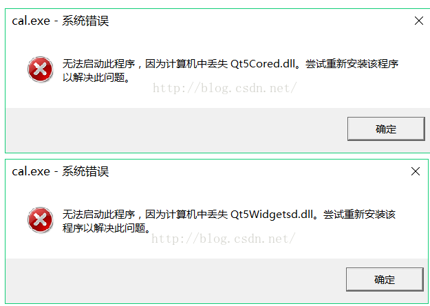

Title: Qt开发中遇到的问题
Date: 2021-5-12 17:00
Category: Cpp
Tags: Programe,Qt
Authors: leelongcrazy
Summary: Qt框架的使用中所踩过的坑记录

## Qt Creator 中

项目路径切换，或文件夹重新命名后，执行编译路径出错：

1. 在该项目执行 qmake  重新生成编译文件 MakeFile
2. 再执行编译

## Qt项目软件打包发布，安装包运行安装完成后程序运行出现缺少dll文件的问题？

##### 比如像这样的错误：

**解决办法**

* 思路：配置QT的环境变量
* [参考文章](https://blog.csdn.net/qq_17346105/article/details/51497585)

## 在Qt开发中遇到程序运行后点击按钮异常退出的情况：

* 直接在函数中访问了私有属性的数据变量，被禁止访问，程序退出；
* 借助调试功能找出异常退出的位置，分析可能导致退出的原因。

## Qt项目编译出现`QMetaObject::connectSlotsByName: No matching signal for slotName`的错误？

> 槽函数命令的问题，重新修改为一个更简短的名字，不要有过多的下划线，重新编译；

可参考文章：[[QMetaObject::connectSlotsByName: No matching signal](https://stackoverflow.com/questions/24355023/qmetaobjectconnectslotsbyname-no-matching-signal)]

## Qt信号与槽函数未能执行的原因分析：
* 使用了自定义的信号类型，未能进行注册，可使用qRegisterMetaType注册一下该类型；
* connect函数的第一个参数，需要的是类型指针；